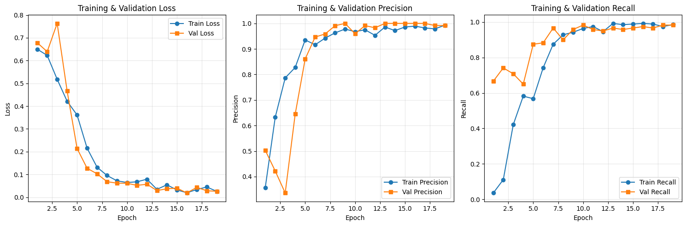
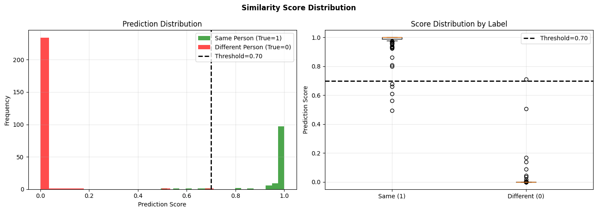
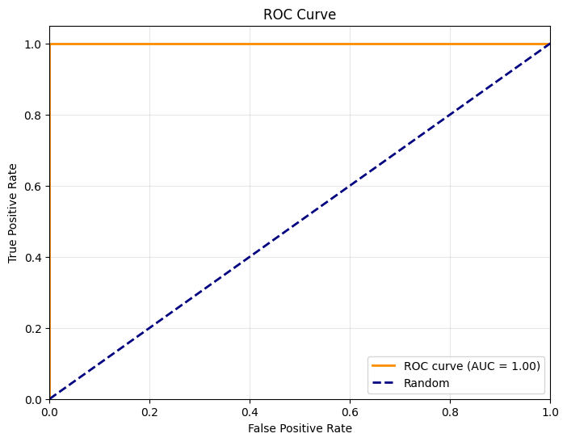

# Do you recognize me? 

*A real-time facial verification system built with TensorFlow and Streamlit.*
This project implements a Siamese Neural Network architecture to authenticate a person identity by comparing a live webcam capture against stored reference images.  
This repository was created for the course "Introduction to Biometrics" at the University of Applied Sciences(HTW) Berlin. 
The project is based on the tutorial by Nicholas Renotte (https://www.youtube.com/watch?v=1gUj6k0k5xM) and extends it with additional evaluation notebooks, on-the-fly augmentation, and a Streamlit user interface.
---  
  
## Table of Contents  
  
- [Scientific Background](#scientific-background)  
- [Project Overview](#project-overview)  
- [Repository Structure](#repository-structure)  
- [Setup and Installation](#setup-and-installation)  
- [Data Collection](#data-collection)  
- [Notebook Walkthrough](#notebook-walkthrough)  
- [Model Architecture](#model-architecture)  
- [Training Details](#training-details)  
- [Threshold Tuning](#threshold-tuning)  
- [Configuration (config.py)](#configuration-configpy)  
- [Streamlit Application](#streamlit-application)  
- [Evaluation and Performance](#evaluation-and-performance)  
- [What Was Tried for Reliable Verification](#what-was-tried-for-reliable-verification)  
- [Dataset Diversity Considerations](#dataset-diversity-considerations)  
- [Sources](#sources)  
  
---  
  
## Scientific Background  
  
The core idea of this implementation is based on the seminal paper by **Koch, Gregory, Richard Zemel, and Ruslan Salakhutdinov (2015)**, *Siamese Neural Networks for One-Shot Image Recognition* (https://www.cs.utoronto.ca/~rsalakhu/papers/oneshot1.pdf). Instead of training a network to classify fixed identity classes, which would require retraining every time a new person is added,  a Siamese network learns a **similarity metric** between two input images.  
  
The architecture consists of two identical twin sub-networks with **shared weights (weight tying)**. Each sub-network extracts a feature vector (embedding) from an input image. By sharing parameters between the two branches, the network is forced to map similar-looking images to nearby regions in the feature space, structurally enforcing the idea of similarity at the architectural level. This weight-tying mechanism is a core contribution of Koch et al. (2015) and is what enables the network to perform one-shot learning -- recognizing new identities from a single reference image.  
  
The output of the twin networks is compared using a distance metric (L1 distance / Manhattan distance), and a final sigmoid classifier converts this distance into a similarity score between 0 and 1.  
  
**Key advantage:** The network can verify identities it has never seen during training, because it learns the concept of same vs. different rather than specific identity labels. This is the essence of one-shot learning as described by Koch et al. (2015).  
  
---  
  
## Project Overview  
  
This project implements an end-to-end face verification pipeline:  
  
1. **Data Collection** -- Capture webcam images of the target person (anchor/reference) and utilize a large set of negative images (other people) from the LFW dataset.  
2. **Preprocessing** -- Resize images to 100x100 pixels, normalize pixel values to [0, 1], apply on-the-fly data augmentation.  
3. **Model Training** -- Train a Siamese Neural Network to distinguish between same-person and different-person image pairs. Uses binary crossentropy loss with an Adam optimizer.  
4. **Evaluation** -- Evaluate the model on held-out test data using metrics such as precision, recall, F1-score, ROC-AUC, .  
5. **Live Verification** -- Deploy the trained model in a Streamlit web application for real-time webcam-based face verification.  
  
The codebase follows the tutorial structure by **Nicholas Renotte** (see [Sources](#sources)) and extends it with additional evaluation notebooks, on-the-fly augmentation, and a Streamlit user interface.  
  
---  
  
## Repository Structure  
  
```  
project_root/  
+-- config.py                    # Central configuration (paths, hyperparameters)  
+-- requirements.txt             # Python dependencies  
+-- main.py                      # Entry point for training  
+-- webcam_data_collection.py    # Script: collect anchor/positive webcam images  
+-- collect_test_persons.py      # Script: collect images of test persons  
+-- create_negativedataset.py    # Script: extract LFW dataset into negative folder  
+-- live_verification.py         # Streamlit application for live verification 
+-- collect_test_persons.py  # script for collecting multiple peoples data   
+-- data/  
|   +-- anchor/                  # Reference images of the target person  
|   +-- positive/                # Additional images of the target person  
|   +-- negative/                # Images of other people (from LFW dataset)  
+-- notebooks/  
|   +-- 00_setup.ipynb           # Environment verification and GPU setup  
|   +-- 01_data_collection.ipynb # Data exploration and augmentation visualization  
|   +-- 02_preprocessing.ipynb   # Dataset pipeline creation  
|   +-- 03_model_architecture.ipynb # Siamese network construction  
|   +-- 04_training.ipynb        # Model training with early stopping  
|   +-- 05_evaluation.ipynb      # Model evaluation and threshold optimization  
|   +-- 06_inference.ipynb       # Notebook-based live verification  
|   +-- 07_fmr_fnmr_analysis.ipynb # FMR, FNMR, EER analysis  
|   +-- data_collection_webcam.ipynb # Webcam data collection  
+-- src/  
|   +-- data.py                  # Data loading, preprocessing,* augmentation  
|   +-- models.py                # Siamese network model definition  
|   +-- training.py              # Training loop, checkpointing, early stopping  
|   +-- utils.py                 # Utility functions (metrics, plotting)  
|   +-- __init__.py    
+-- checkpoints/                 # Saved model checkpoints  
```  
  
---  
  
## Setup and Installation  
  
### Prerequisites  
  
- **Python 3.9** is recommended for full TensorFlow compatibility.  
- A **webcam** is required for data collection and live verification.  
- A **GPU** is recommended for faster training (NVIDIA with CUDA support), but CPU training is fully supported.  
  
### Step 1: Virtual Environment  
  
```bash  
python -m venv venv  

# On Windows:  
venv\Scripts\activate  
  
# On Linux/Mac:  
source venv/bin/activate
```  
  
### Step 2: Install Dependencies  
  
 ```
pip install -r requirements.txt
```

This installs:  
- `tensorflow` -- Deep learning framework  
- `streamlit` -- Web application framework for live verification  
- `opencv-python` -- Webcam access and image processing  
- `numpy` -- Numerical computing  
- `matplotlib` -- Plotting and visualization  
- `scikit-learn` -- Additional metrics  
- `Pillow` -- Image file handling  
  
### Step 3: Jupyter Kernel (Optional)  
  
If you run the notebooks inside the virtual environment, register the kernel:  
  
```bash  
python -m ipykernel install --user --name=venv --display-name="Python (venv)"
```  
  
### Step 4: Verify Setup  
  
Run the `00_setup.ipynb` notebook to verify that TensorFlow detects your GPU (if available) and that all dependencies are installed correctly.  
  
The project is designed to work with or without a GPU. If no GPU is detected, it falls back to CPU automatically. GPU memory growth is enabled by default to prevent out-of-memory errors.  
  
---  
  
## Data Collection  
  
The Siamese network requires three types of image data:  
  
| Category | Description | Content                                        |  
|----------|-------------|------------------------------------------------|  
| Anchor | Reference images of the target person | ~400 webcam images of the user                 |  
| Positive | Additional images of the same person | ~400 webcam images (different poses, lighting) |  
| Negative | Images of other people | ~800+ images from the LFW dataset              |  

This ratio was selected to still mantain a balanced dataset for training. The negative dataset is still larger to provide sufficient diversity of impostor faces.
  
### Collecting Anchor and Positive Images  
  
Use the webcam data collection tool to capture images of the target person:  
  
```bash  
python collect_data.py
```  
  
Controls:  
- Press **a** to save an image as **Anchor**  
- Press **p** to save an image as **Positive**  
- Press **q** to quit  
  
For optimal results, capture images in multiple different settings, lighting conditions, angles, and facial expressions. The more diverse the training images, the better the model will generalize. This project needs at least 400 images each in the anchor and positive folders.  
  
### Setting Up the Negative Dataset  
  
The negative dataset consists of images of other people, faces the model must learn to reject. This project uses the **LFW (Labeled Faces in the Wild)** dataset:  
  
1. Download the dataset from: https://www.kaggle.com/datasets/atulanandjha/lfwpeople  
2. Extract the downloaded archive (tar.gz file).
3. Run the extraction script:  
  
```bash  
python create_negativedataset.py
```  
  
This moves all images from the LFW subdirectories into the `data/negative/` folder. After extraction, you can delete the original empty `lfw/` folder.  
  
### Collecting Test Persons (for External Evaluation)  
  
To evaluate how the model performs on completely unknown people, collect images of test persons:  
  
```bash  
python collect_test_persons.py
```  
  
Controls:  
- Press **SPACE** to save an image  
- Press **n** to switch to the next person  
- Press **q** to quit  
  
The script creates sub-folders under `data/test/` named `person_001/`, `person_002/`, etc., each containing captured images. Collect 3-5 different people with at least 15 images each for a meaningful external evaluation.  
This section was started but its evaluation was not continued due to time management reasons.

## Notebook Walkthrough  
  
The notebooks should be run **in order**, as each builds upon the previous one.  
  
### 00_setup.ipynb -- Environment Setup  
  
Verifies that TensorFlow is installed correctly, detects available GPUs, configures GPU memory growth, and checks that all paths exist.  
  
### 01_data_collection.ipynb -- Data Exploration  
  
Loads images from the anchor, positive, and negative directories. Visualizes sample images and demonstrates the on-the-fly augmentation pipeline, showing how different augmentations (brightness, contrast, saturation, flip) transform a single image.  
  
### 02_preprocessing.ipynb -- Data Pipeline  
  
Creates the TensorFlow `tf.data` pipeline that:  
- Loads and resizes images to 100x100 pixels  
- Normalizes pixel values to the [0, 1] range  
- Applies on-the-fly augmentation (during training only, not for evaluation)  
- Batches data and prefetches for performance  
  
### 03_model_architecture.ipynb -- Siamese Network  
  
Builds the Siamese Neural Network architecture. The architecture follows the principles described by Koch et al. (2015): two identical embedding networks with shared weights extract feature vectors, the L1 distance between these embeddings is computed, and a sigmoid classifier produces the similarity score.  
  
The embedding network consists of:  
- Conv2D (64 filters, 10x10 kernel) + MaxPooling (2x2)  
- Conv2D (128 filters, 7x7 kernel) + MaxPooling (2x2)  
- Conv2D (128 filters, 4x4 kernel) + MaxPooling (2x2)  
- Conv2D (256 filters, 4x4 kernel)  
- Flatten + Dense (4096 units, sigmoid activation)  
  
A custom L1Dist layer computes `|embedding1 - embedding2|`, and a final Dense layer with sigmoid activation outputs the similarity score in [0, 1].  
  
### 04_training.ipynb -- Model Training  
  
Trains the Siamese network using a custom training loop. Key features:  
  
- **Loss Function:** Binary Crossentropy -- ideal for the binary verification task (same = 1, different = 0).  
- **Optimizer:** Adam with a learning rate of 1e-4, which provides stable convergence.  
- **Early Stopping:** Monitors the validation loss. If it does not improve for `EARLY_STOPPING_PATIENCE` (configurable, default: 3) consecutive epochs, training halts. To prevent overfitting and save time.  
- **Best Epoch Selection:** Checkpoints are saved **only when the validation loss improves** (`save_best_only=True`). The `best_val_loss` and `best_epoch` are tracked in real-time during training. Since checkpoints are exclusively saved on improvement, the **latest checkpoint is automatically the best checkpoint** so no post-training scanning is needed.  
- **Checkpointing:** Model weights are saved **only when the validation loss improves** (default: `save_best_only=True`). Additionally, a final checkpoint (`siamese_final.keras`) and the full training history (`training_history.json`) are always saved at the end of training.  
  
The training loop outputs per-epoch metrics:  
- Training loss and validation loss  
- Training precision and validation precision  
- Training recall and validation recall  
  
### 05_evaluation.ipynb -- Model Evaluation  
  
Evaluates the trained model on the held-out test dataset:  
  
1. **Prediction:** Generates similarity scores for all test pairs.  
2. **Confusion Matrix:** Calculates true positives, true negatives, false positives, and false negatives.  
3. **Metrics Computation:** Accuracy, precision, recall, and F1-score at threshold 0.5.  
4. **Threshold Optimization:** Searches for the optimal threshold that maximizes the F1-score. This is critical for real-world deployment because a threshold of 0.5 may not be optimal.  
5. **ROC Curve:** Plots the receiver operating characteristic and computes the AUC score.  
6. **Score Distribution:** Visualizes the distribution of prediction scores for same-person vs. different-person pairs.  
  
The evaluation reveals whether the model is overfitting. If training metrics are near-perfect (precision/recall near 1.0) but test metrics are poor, the model has memorized the training data rather than learning generalizable features.  
  
### 06_inference.ipynb -- Verification (Notebook)  
  
Provides a notebook-based verification with the test data.  
  
### 07_fmr_fnmr_analysis.ipynb -- Advanced Evaluation  
  
Performs a deeper evaluation using biometric security metrics:  
  
- **FMR (False Match Rate):** The rate at which impostors (different people) are incorrectly accepted.  
- **FNMR (False Non-Match Rate):** The rate at which genuine users (same person) are incorrectly rejected.  
- **EER (Equal Error Rate):** The threshold where FMR equals FNMR. The EER is the standard biometric threshold and represents the optimal balance between security and usability.  
  
This notebook uses the external test data (collected via `collect_test_persons.py`) to provide an unbiased evaluation on completely unseen individuals. The further implementation was unfortunately not continued.
  
---  
  
## Model Architecture  
  
The Siamese network consists of three main components:  
  
### 1. Embedding Network  
  
A convolutional neural network that transforms an input image (100x100x3) into a feature vector (4096 dimensions). The architecture contains four convolutional blocks with increasing filter counts (64 to 128 to 128 to 256) and max-pooling layers that progressively reduce spatial dimensions while increasing feature depth. The final dense layer with 4096 sigmoid units produces a normalized embedding.  
  
Both input images (anchor and verification) pass through the **same** embedding network with **shared weights**. This weight tying, as described by Koch et al. (2015), ensures that similar inputs produce similar embeddings, which is the fundamental principle of metric learning.  
  
### 2. L1 Distance Layer  
  
A custom layer that computes the element-wise absolute difference between the two embeddings:  
  
`distance = |embedding_anchor - embedding_verification|`  
  
This produces a vector where each element represents how different the two images are along that feature dimension.  
  
### 3. Classifier  
  
A single Dense layer with 1 unit and sigmoid activation that converts the distance vector into a single similarity score:  
  
- Score close to 1.0: The images are likely the same person (VERIFIED)  
- Score close to 0.0: The images are likely different people (NOT VERIFIED)  
  
### Total Parameters  
  
The full Siamese network contains approximately **38.9 million** trainable parameters, all located in the embedding network (the classifier adds negligible parameters).  
  
---  
  
## Training Details  
  
### Triplet Dataset Construction  
  
The training data is constructed as pairs of images:  
  
- **Positive pairs:** One anchor image + one positive image (both of the target person). Label = 1 (same person).  
- **Negative pairs:** One anchor image + one negative image (a different person). Label = 0 (different person).  
  
The dataset contains an equal number of positive and negative pairs to ensure balanced training. When using the `load_all_datasets` function, the data is split at the **person level**, not the image level. This means the same person images never appear in both the training and test sets, preventing data leakage.  
  
### On-the-Fly Augmentation  
  
Data augmentation is applied **during training only** (not during evaluation) and is performed on the fly -- augmented images are generated in memory and never saved to disk. This is important because:  
  
1. **Storage efficiency:** No disk space is used for augmented copies.  
2. **Virtually unlimited data:** Each epoch sees different random augmentations, effectively multiplying the dataset size by the number of epochs.  
3. **Better generalization:** The model learns to be invariant to lighting changes, contrast variations, and mirror flips.  
  
The applied augmentations are:  
- Random brightness adjustment (+/- 30%)  
- Random contrast adjustment (0.8x - 1.2x)  
- Random saturation adjustment (0.8x - 1.2x)  
- Random horizontal flip (50% probability)  
  
### Early Stopping and Best Epoch  

**Early stopping** is a regularization technique that monitors the validation loss during training. If the validation loss does not improve for a set number of epochs (patience), training is stopped early. This prevents the model from overfitting to the training data, which would manifest as a continuously decreasing training loss but an increasing (or plateaued) validation loss.  

The **best epoch** is the epoch at which the validation loss was at its minimum. With `save_best_only=True`, a checkpoint is saved **immediately** whenever the validation loss drops (improves). This means:
- The most recently saved checkpoint is guaranteed to be the best one.
- No post-training search over checkpoints is required.
- The best epoch and its validation loss are tracked in memory during training (`best_val_loss`, `best_epoch`) and printed in the training summary.

Using the best epoch is standard practice because after this point, the model typically begins to overfit (validation loss increases even as training loss continues to decrease).  
  
### Training Command  
  
 run the `04_training.ipynb` notebook cell by cell.  
  
**Training output example:**  
  
```  
TRAINING SUMMARY  
================================================================================  
Total Epochs: 17  
Best Epoch: 16  
Best Val Loss: 0.000140  
  
Final Metrics (Epoch 17):  
Train Loss: 0.000154  Val Loss: 0.000226  
Train Precision: 1.0000  Val Precision: 1.0000  
Train Recall: 1.0000  Val Recall: 1.0000  
```  
  
### Expected Training Duration  
  
- **GPU (8GB VRAM):** 10-20 minutes for full training with early stopping.  
- **CPU:** 1-2 hours for full training.  
  
---  
  
## Threshold Tuning  

The optimal threshold for verification is determined through a systematic search in Notebook 05. The process works as follows:
  
1. The model generates similarity scores for all test image pairs.  
2. A range of thresholds (typically from 0.01 to 0.99) is evaluated.  
3. For each threshold, the F1-score is calculated based on the confusion matrix.  
4. The threshold that **maximizes the F1-score** is selected as optimal.  
  
This approach was chosen because the F1-score balances precision (minimizing false accepts) and recall (minimizing false rejects), which is appropriate for a verification system.  

However, you can also choose a **stricter threshold** to prioritize security over user convenience. A higher threshold (e.g., 0.95 instead of 0.7) reduces False Positives (unauthorized persons being accepted) at the cost of a slightly lower F1-score. This trade-off means:

- **Lower threshold (e.g., 0.7):** Higher F1-score, more balanced between True Positives and True Negatives, but some unauthorized persons may slip through.  
- **Higher threshold (e.g., 0.95):** Lower F1-score (e.g., drops by ~0.0365), but **higher precision** — the system becomes more conservative and accepts only very confident matches, virtually eliminating False Positives.

This is especially useful in security-critical scenarios where preventing unauthorized access is more important than avoiding false rejections.

In addition to the F1-based threshold, notebook 07 calculates the **Equal Error Rate (EER)** -- the threshold where the False Match Rate equals the False Non-Match Rate. The EER is the standard biometric threshold and provides a reference point for security-critical applications.  
  
---  
  
## Configuration (config.py)  
  
The central configuration file `config.py` contains all adjustable parameters for the project:  
  
### Paths  
  
```python  
PROJECT_ROOT = Path(__file__).parent  
DATA_DIR = PROJECT_ROOT / "data"  
ANCHOR_PATH = DATA_DIR / "anchor"  
POSITIVE_PATH = DATA_DIR / "positive"  
NEGATIVE_PATH = DATA_DIR / "negative"  
CHECKPOINT_DIR = PROJECT_ROOT / "checkpoints"  
```  
  
### Image Processing  
  
```python  
IMG_SIZE = 100    # Target image size (100x100 pixels)  
IMG_CHANNELS = 3  # RGB color channels  
```  
  
### Training Hyperparameters  
  
```python  
BATCH_SIZE = 16                # Adjustable based on GPU memory  
LEARNING_RATE = 1e-4           # Adam optimizer learning rate  
EPOCHS = 50                    # Maximum number of epochs  
EARLY_STOPPING_PATIENCE = 3    # Patience for early stopping  
EARLY_STOPPING_MIN_DELTA = 1e-4  # Minimum improvement threshold  
```  
  
### Data Augmentation  
  
```python  
BRIGHTNESS_MAX_DELTA = 0.30   # Maximum brightness adjustment (+/- 30%)  
CONTRAST_LOWER = 0.8          # Lower bound for contrast adjustment  
CONTRAST_UPPER = 1.2          # Upper bound for contrast adjustment  
SATURATION_LOWER = 0.8        # Lower bound for saturation adjustment  
SATURATION_UPPER = 1.2        # Upper bound for saturation adjustment  
FLIP_PROB = 0.5               # Probability of horizontal flip  
```  
  
### Model Architecture  
  
```python  
FILTERS_1 = 64   KERNEL_1 = (10, 10)  POOL_1 = (2, 2)  
FILTERS_2 = 128  KERNEL_2 = (7, 7)   POOL_2 = (2, 2)  
FILTERS_3 = 128  KERNEL_3 = (4, 4)   POOL_3 = (2, 2)  
FILTERS_4 = 256  KERNEL_4 = (4, 4)  
DENSE_UNITS = 4096  
ACTIVATION = 'sigmoid'   
```  
  
### Verification Threshold  
  
```python  
VERIFICATION_THRESHOLD = 0.5  # Threshold for Siamese network output  
```  
  
### GPU Configuration  
  
```python  
ENABLE_GPU = True  
GPU_MEMORY_GROWTH = True      # Prevents Out-Of-Memory (OOM) errors  
GPU_MEMORY_LIMIT_MB = None    # None = automatic, set to limit GPU memory usage  
```  
  
---  
  
## Streamlit Application  
  
The trained model can be deployed as a live verification application using Streamlit:  
  
```bash  
streamlit run live_verification.py
```  
  
### Features  
  
- **Webcam Integration:** The application accesses the default webcam (configurable) and displays a live preview.  
- **Real-Time Verification:** When activated, the application captures a frame and compares it against randomly selected anchor images.  
- **Face Detection** The application checks if a face is visible in a taken image, before starting a verification.
- **Similarity Score Display:** The verification score is shown with a color-coded result (green for VERIFIED, red for NOT VERIFIED).  
- **Adjustable Threshold:** The verification threshold can be modified to balance security and usability.  
  
### Application Flow  
  
1. The application loads the trained Siamese model from the best checkpoint.  
2. Anchor images are loaded from `data/anchor/`.  
3. The webcam feed is displayed in the Streamlit interface.  
4. When the user clicks Verify, a frame is captured and compared against the shown anchor image.  
5. The similarity score is computed and displayed with the verification result.  
  
---  
  
## Evaluation and Performance 

### Metrics  
  
The model performance is evaluated using the following metrics:  
  
- **Accuracy:** Overall proportion of correct predictions.  
- **Precision:** Proportion of positive predictions that were correct (true positives / (true positives + false positives)).  
- **Recall:** Proportion of actual positives that were correctly identified (true positives / (true positives + false negatives)).  
- **F1-Score:** Harmonic mean of precision and recall.  
- **ROC-AUC:** Area under the Receiver Operating Characteristic curve.  
- **FMR (False Match Rate):** Proportion of impostor attempts that were incorrectly accepted.  
- **FNMR (False Non-Match Rate):** Proportion of genuine attempts that were incorrectly rejected.  
- **EER (Equal Error Rate):** Threshold where FMR equals FNMR. 

### Example Evaluation

### Training History



The model converges quickly and achieves very low training and validation loss. Precision and recall remain high and closely aligned on both datasets, indicating stable learning without clear signs of overfitting. 
traininghistory.png
Prediction scores show a strong separation between matching and non-matching face pairs: genuine pairs are mostly scored close to 1.0, while non-matching pairs are concentrated near 0.0. With a threshold of 0.70, most pairs are classified correctly; only a few high-scoring negative pairs may lead to false matches.
### Prediction Distribution



The model assigns scores close to 1.0 for pairs showing the same person and scores close to 0.0 for different-person pairs. With a threshold of 0.70, both classes are almost perfectly separated. Although this indicates strong performance, the unusually sharp separation may suggest that the evaluation data are too easy, limited, or similar to the training data.

### ROC Curve



The training and validation curves converge closely, with low loss and similarly high precision and recall. Therefore, the training history alone does not show a typical overfitting gap. 
traininghistory.png
However, the evaluation results are almost perfect: prediction scores are concentrated near 0 for different-person pairs and near 1 for same-person pairs, while the ROC curve reaches an AUC of 1.00. This unusually clear separation may indicate that the test data are too easy, highly similar to the training data, or affected by data leakage. A strictly identity-disjoint and more diverse test set is required to confirm real-world generalization.
### Conclusion

The Siamese network performs very well on the current evaluation data and does not show obvious overfitting in the training history. Nevertheless, the near-perfect prediction distribution and ROC score should be validated with a larger, more challenging, and identity-disjoint test set.

  
### Common Issues: Overfitting  
  
A frequent challenge with single-person Siamese networks is **overfitting**. When only one person is available as the anchor, the network may memorize features of that specific face rather than learning a general similarity metric. Signs of overfitting include:  
  
- Training metrics near perfection (precision = 1.0, recall = 1.0).  
- Validation metrics that are significantly worse than training metrics.  
- Poor performance on completely unseen individuals.  
- Similarity scores that cluster around a single value (e.g., 0.8) regardless of whether the input pair is genuine or impostor.  
  
---  
  
## What Was Tried for Reliable Verification  
  
Several approaches were attempted and evaluated to achieve a robust face verification system:  
  
### 1. Person-Level Data Split (Critical Fix)  
  
The original data pipeline split images at the **image level** rather than the **person level**. This meant that the same person's images appeared in both the training and test sets, causing data leakage and inflated evaluation metrics. The fix was to implement `load_all_datasets()` in `src/data.py`, which splits anchor/positive and negative images **before** creating the triplet datasets, ensuring that no person appears in both training and test splits.  
  
### 2. On-the-Fly Augmentation  
  
Instead of generating augmented images on disk (which would consume significant storage), augmentation is applied during training in memory. This provides virtually unlimited training variations without disk overhead. The augmentation parameters (brightness, contrast, saturation, flip) were tuned to provide realistic variations without distorting facial features beyond recognition.  
  
### 3. Early Stopping with Patience  
  
Early stopping was implemented to halt training when the validation loss stops improving. The patience parameter was tuned through experimentation. Values between 3 and 10 epochs were tested, with the final configuration using a patience of 5-10 epochs depending on the training run.  
  
### 4. Dropout and L2 Regularization  
  
To further combat overfitting, the model architecture was extended with:  
- **Dropout (rate 0.45):** Randomly drops 45% of neurons during training to prevent co-adaptation.  
- **L2 Weight Decay (1e-3):** Adds a penalty to the loss function proportional to the square of the weights, discouraging the model from relying too heavily on any single feature.  

Both values were  increased (from 0.35 → 0.45 for dropout and from 1e-4 → 1e-3 for L2 weight decay) to strengthen regularization and further reduce overfitting.  
  
### 5. Balanced Dataset Construction  
  
The triplet dataset is constructed with **equal numbers** of positive and negative pairs to prevent the model from learning a biased decision boundary. Without this balance, a model that always predicts the majority class would achieve high accuracy without learning anything meaningful. 

### Cross-Setting & Lighting Robustness:

To ensure the network learns identity rather than environmental factors, anchor and positive images were explicitly sampled across different operational settings and varying illumination conditions. This forces the embeddings to remain invariant to shadows, highlights, and background shifts.
  
### 6. Verification Threshold Optimization  
  
In alignment with biometric security constraints, the verification threshold was strategically adjusted (increased for distance metrics / lowered for similarity metrics) to strictly minimize the **False Acceptance Rate (FAR)**. Preventing unauthorized access (False Positives) was prioritized over minor degradation in user convenience (False Negatives). 
  
---  

## What to do if the Live-Verification seem unreliable
- move further or closer to the camera
- set a very strict threshold (f.e 0.95)
  
## Dataset Diversity Considerations  
  
### Skin Tone and Demographic Bias  
  
This project was developed with a user of **dark skin tone**. This introduces an important consideration for face verification systems:  
  
- **LFW Dataset Composition:** The LFW dataset, used as the negative training set, is known to have a demographic bias toward lighter skin tones. This means the negative examples the model sees during training may not be representative of the diversity in real-world applications.  
- **Training Data Characteristics:** The anchor and positive images (the only person the model learns as genuine) come from a single individual with dark skin. The model learns to recognize this specific person's features, including skin tone, as the genuine identity.  
- **Potential Impact on Verification:** When verifying a different person with dark skin, the model might produce a higher similarity score than expected because the skin tone matches the anchor person, even though it is a different individual. Conversely, when verifying a person with lighter skin, the model might produce a lower score, making it easier to reject impostors but potentially introducing false rejections for legitimate users with lighter skin.  
  
These considerations are not unique to this project, they reflect a well-known challenge in the face recognition community. The on-the-fly augmentation (brightness, contrast adjustments) partially addresses this by making the model less sensitive to pixel-level variations, but it does not eliminate demographic bias.  
  
**Recommendation for future work:** Collect anchor/positive data from multiple individuals with diverse skin tones and facial features to train a more robust verification system.  
  
---  

## Known Warnings  

When starting training or the Streamlit app, the following message may appear:  

```
WARNING: All log messages before absl::InitializeLog() is called are written to STDERR
I0000 00:00:... Created TensorFlow device (.../device:GPU:0 ... physical PluggableDevice (device: 0, name: METAL, pci bus id: <undefined>)
```

This message is **harmless**. It comes from TensorFlow's C++ backend and only indicates that a GPU (e.g., Apple Metal) was detected. The output does not affect training or verification and can be ignored.

---  

## Sources  
  
1. **Koch, Gregory, Richard Zemel, and Ruslan Salakhutdinov (2015):** *Siamese Neural Networks for One-Shot Image Recognition*. Available at: https://www.cs.utoronto.ca/~rsalakhu/papers/oneshot1.pdf (last accessed: May 30, 2026).  
  
2. **Nicholas Renotte (2022):** *Face Recognition with TensorFlow Tutorial Series*. YouTube playlist: https://www.youtube.com/playlist?list=PLgNJO2hghbmhHuhURAGbe6KWpiYZt0AMH. GitHub repository: https://github.com/nicknochnack/FaceRecognition/tree/main.  
  
3. **LFW Dataset (Labeled Faces in the Wild):** Available on Kaggle: https://www.kaggle.com/datasets/atulanandjha/lfwpeople.
